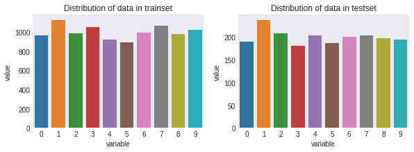

MNIST example with Subspace Method
==================================

In the example code of this tutorial, we assume for simplicity that the
following symbols are already imported.

.. code:: ipython3

    import sys, os, numpy as np
    import matplotlib.pyplot as plt, seaborn as sns
    sys.path.insert(0, os.pardir)
    import warnings
    warnings.filterwarnings('ignore')
    
    from sklearn.datasets import fetch_openml
    from sklearn.model_selection import train_test_split,RandomizedSearchCV
    from sklearn.utils import check_random_state
    from sklearn.metrics import accuracy_score
    
    from scipy.stats import randint as sp_randint
    
    from cvt.models import SubspaceMethod

In this tutorial section, we will learn how to train a simple subspace
based classifier to classify images of hand-written digits in the
popular MNIST dataset. To show the effectiveness of this method we will
compare the results to a sklearn KNN classifier.

The MNIST dataset contains 50,000 training examples and 10,000 test
examples. Each example is a set of a 28 x 28 greyscale image and a
corresponding class label. Since the digits from 0 to 9 are used, there
are 10 classes for the labels.

We will conduct the procedure in the following steps.

1. Prepare a dataset
2. Train the SV classifier
3. Train the SM classifier
4. Improving results
5. In depth comparison

1. Prepare a dataset
--------------------

Sklearn provides an (experimental) API to fetch datasets from openml by
name or dataset id.

.. code:: ipython3

    # Fetch the MNIST data
    X, y = fetch_openml('mnist_784', version=1, return_X_y=True)
    
    X_train, X_test, y_train, y_test = train_test_split(
        X, y, train_size=10000, test_size=2000)

.. code:: ipython3

    # Display an example from the MNIST dataset.
    # `x` contains the input image array and `t` contains that target class
    # label as an integer.
    
    x, t = X[0], y[0]
    plt.style.use('seaborn-dark')
    plt.imshow(x.reshape(28, 28), cmap='gray')
    plt.title(f'Image of label: {t}')
    plt.show()

.. image:: ../_static/mnist_example/output_5_0.png

.. code:: ipython3

    from scipy.constants import golden as g_ratio
    from pandas import DataFrame as DF
    from collections import Counter
    
    # Display the distribution of the testset and trainset
    # Take note of the slight inbalance maybe?
    fig =  plt.figure(figsize=(6*g_ratio, 3))
    
    sns.barplot(x="variable", y="value", data=DF(Counter(y_train), index=['val']).melt(), ax=fig.add_subplot(121))
    plt.title('Distribution of data in trainset')
    
    sns.barplot(x="variable", y="value", data=DF(Counter(y_test), index=['val']).melt(), ax=fig.add_subplot(122))
    plt.title('Distribution of data in testset')
    plt.show()

2. Train a Support Vector classifier
------------------------------------

From the scikit learn
`docs <https://scikit-learn.org/stable/modules/svm.html#svm-kernels>`__\ …

Support vector machines (SVMs) are a set of supervised learning methods
used for classification, regression and outliers detection.

The advantages of support vector machines are:

-  Effective in high dimensional spaces.
-  Still effective in cases where number of dimensions is greater than
   the number of samples.
-  Uses a subset of training points in the decision function (called
   support vectors), so it is also memory efficient.
-  Versatile: different Kernel functions can be specified for the
   decision function. Common kernels are provided, but it is also
   possible to specify custom kernels.

The disadvantages of support vector machines include:

-  If the number of features is much greater than the number of samples,
   avoid over-fitting in choosing Kernel functions and regularization
   term is crucial.

-  SVMs do not directly provide probability estimates, these are
   calculated using an expensive five-fold cross-validation.

--------------

Here we will train a C-Support Vector classifier with a linear kernel
using an `implementaion by scikit
learn <https://scikit-learn.org/stable/modules/generated/sklearn.svm.SVC.html>`__.
Although the rbf kernel will work better, it won’t be fair to compare it
to the linear subspace method. SM has non-linear extensions such as
kernel-MSM which will better suited for comparison.

.. code:: ipython3

    from sklearn.svm import SVC
    
    svc = SVC(C=1, kernel='linear')
    
    # Fit the data
    svc.fit(X_train, y_train)
    # Predict the classes
    y_pred = svc.predict(X_test)
    # Caluclate the accuracy
    accuracy_score(y_test, y_pred)

.. parsed-literal::

    0.901

3. Train a K-NN Classifier
--------------------------

From the scikit learn
`docs <https://scikit-learn.org/stable/modules/neighbors.html#classification>`__\ …

Neighbors-based classification is a type of instance-based learning or
non-generalizing learning: it does not attempt to construct a general
internal model, but simply stores instances of the training data.
Classification is computed from a simple majority vote of the nearest
neighbors of each point: a query point is assigned the data class which
has the most representatives within the nearest neighbors of the point.

The optimal choice of the value K is highly data-dependent: in general a
larger suppresses the effects of noise, but makes the classification
boundaries less distinct.

--------------

The K-NN classifier is simple and effective but it’s computation does
take time and scales in quadractic time.

.. code:: ipython3

    from sklearn.neighbors import KNeighborsClassifier
    
    knnc = KNeighborsClassifier(n_neighbors=5)
    # Fit the data
    knnc.fit(X_train, y_train)
    # Predict the classes
    y_pred = knnc.predict(X_test)
    # Caluclate the accuracy
    accuracy_score(y_test, y_pred)

.. parsed-literal::

    0.9435

4. Train a SM classifier
------------------------

Next, we will use the Subspace Method (SM) to perform classification. In
SM we classify an input pattern vector into several classes based on the
minimum distance or angle between the input pattern vector and each
class subspace. A class subspace corresponds to the distribution of
pattern vectors of the class in high dimensional vector space.

For more infomation on how the SM works, see
`here <http://www.cvlab.cs.tsukuba.ac.jp/~kfukui/english/epapers/subspace_method.pdf>`__.

One caveat to remeber when using this implementation is that the input
must be *list* of 2d-arrays (n_classes, n_dims, n_samples) and a list of
labels for each class (n_classes). This may deviate from sklearn style
principles, but I think it is more intuitive when thinking in subspaces.

※ Input may be revised in the future

.. code:: ipython3

    # This function will take in the X, y defined above 
    # and return the data in the format we need
    def format_input(X, y):
        X = [X[np.where(y==t)] for t in np.unique(y)]
        return X, np.unique(y)
    
    smc = SubspaceMethod(n_subdims=5, faster_mode=True)
    
    # Fit the data
    smc.fit(*format_input(X_train, y_train))
    # Predict the classes
    y_pred = smc.predict(X_test)
    # Caluclate the accuracy
    accuracy_score(y_test, y_pred)

.. parsed-literal::

    0.916

An optimized implementation can be invoked if available. Use this by
passing ``faster_mode=True``.

Below is a speed comparison.

.. code:: ipython3

    %timeit SubspaceMethod(n_subdims=5, faster_mode=False).fit(*format_input(X_train, y_train))

.. parsed-literal::

    427 ms ± 18.2 ms per loop (mean ± std. dev. of 7 runs, 1 loop each)

.. code:: ipython3

    %timeit SubspaceMethod(n_subdims=5, faster_mode=True).fit(*format_input(X_train, y_train))

.. parsed-literal::

    425 ms ± 20.3 ms per loop (mean ± std. dev. of 7 runs, 1 loop each)

5. Improving results
--------------------

Both the K-nearest neighbors classifier and the subspace method
classifier can benefit from hyperparameter tuning.

-  The number K nearest neighbors to include in the majority vote for
   KNN.
-  The number N subspaces to use for SM.

Since we are only tuning one parameter, we can conduct an exhaustive
search. We’ll also keep track of the run time to see how the
hyperparameters effect exectution length.

.. code:: ipython3

    from time import time
    from tqdm import tqdm
    
    # Store results in a dictionary:
    # {(param-value, classifier): (accuracy, time)}
    results = {}
    
    # tqdm shows the approx time left
    # a useful extension for long loops
    for k in tqdm(range(1, 102, 10)):
        start = time()
        svc = SVC(C=k, kernel='linear')
        svc.fit(X_train, y_train)
        y_pred = svc.predict(X_test)
        results[k, 'SVC'] = accuracy_score(y_test, y_pred), time() - start
        
        start = time()
        knnc = KNeighborsClassifier(n_neighbors=k)
        knnc.fit(X_train, y_train)
        y_pred = knnc.predict(X_test)
        results[k, 'KNN'] = accuracy_score(y_test, y_pred), time() - start
        
        start = time()
        smc = SubspaceMethod(n_subdims=k, faster_mode=True)
        smc.fit(*format_input(X_train, y_train))
        y_pred = smc.predict(X_test)
        results[k, 'SM'] = accuracy_score(y_test, y_pred), time() - start

.. parsed-literal::

    
      0%|          | 0/11 [00:00<?, ?it/s]
      9%|▉         | 1/11 [00:45<07:36, 45.60s/it]
     18%|█▊        | 2/11 [01:32<06:53, 45.99s/it]
     27%|██▋       | 3/11 [02:22<06:17, 47.15s/it]
     36%|███▋      | 4/11 [03:10<05:31, 47.36s/it]
     45%|████▌     | 5/11 [03:56<04:42, 47.16s/it]
     55%|█████▍    | 6/11 [04:43<03:54, 46.98s/it]
     64%|██████▎   | 7/11 [05:30<03:07, 46.86s/it]
     73%|███████▎  | 8/11 [06:18<02:21, 47.32s/it]
     82%|████████▏ | 9/11 [07:06<01:35, 47.61s/it]
     91%|█████████ | 10/11 [07:55<00:48, 48.06s/it]
    100%|██████████| 11/11 [08:42<00:00, 47.61s/it]

.. code:: ipython3

    df.sort_values('accuracy', ascending=False).head()

.. raw:: html

    

    
    <table border="1" class="dataframe">
      <thead>
        <tr style="text-align: right;">
          <th></th>
          <th>param value</th>
          <th>Classifier</th>
          <th>accuracy</th>
          <th>time</th>
        </tr>
      </thead>
      <tbody>
        <tr>
          <th>7</th>
          <td>31</td>
          <td>SM</td>
          <td>0.9515</td>
          <td>1.200320</td>
        </tr>
        <tr>
          <th>9</th>
          <td>41</td>
          <td>SM</td>
          <td>0.9500</td>
          <td>1.427801</td>
        </tr>
        <tr>
          <th>5</th>
          <td>21</td>
          <td>SM</td>
          <td>0.9465</td>
          <td>0.939676</td>
        </tr>
        <tr>
          <th>11</th>
          <td>51</td>
          <td>SM</td>
          <td>0.9460</td>
          <td>1.602674</td>
        </tr>
        <tr>
          <th>13</th>
          <td>61</td>
          <td>SM</td>
          <td>0.9420</td>
          <td>1.836834</td>
        </tr>
      </tbody>
    </table>
    

.. code:: ipython3

    fig =  plt.figure(figsize=(6*g_ratio, 3))
    
    data = [(k, clf, score,time) for (k, clf), (score,time) in results.items()]
    df = DF(data, columns=['param value','Classifier','accuracy','time'])
    
    sns.lineplot(x="param value", y="time", hue='Classifier', data=df, ax=fig.add_subplot(121))
    plt.title("Execution Time Comparison")
    
    sns.lineplot(x="param value", y="accuracy", hue='Classifier', data=df, ax=fig.add_subplot(122))
    plt.title("Accuracy Score Comparison")
    
    plt.show()

.. image:: ../_static/mnist_example/output_19_0.png

6. In depth comparison
----------------------

Since we use an scikit-learn like API, we can utilize a lot of the
samples that can be found on their website.

Here we will follow this
`page <https://scikit-learn.org/stable/auto_examples/classification/plot_digits_classification.html>`__
to easily calculate the precision, recall, f1-score and confusion matrix
for each model.

.. code:: ipython3

    knnc = KNeighborsClassifier(n_neighbors=1)
    knnc.fit(X_train, y_train)
    
    svc = SVC(C=1, kernel='linear')
    svc.fit(X_train, y_train)
    
    smc = SubspaceMethod(n_subdims=30, faster_mode=True)
    smc.fit(*format_input(X_train, y_train))
    smc.classes_ = np.unique(y) # これいらないようにコード変える

.. code:: ipython3

    from sklearn import metrics
    
    
    def plot_stats(classifier):
        y_pred = svc.predict(X_test)
        disp = metrics.plot_confusion_matrix(classifier, X_test, y_test)
        disp.figure_.suptitle("Confusion Matrix")
        print("Classification report for classifier %s:\n%s\n"
              % (classifier, metrics.classification_report(y_test, y_pred)))
        plt.show()
    
    plot_stats(svc)
    plot_stats(knnc)
    plot_stats(smc)
