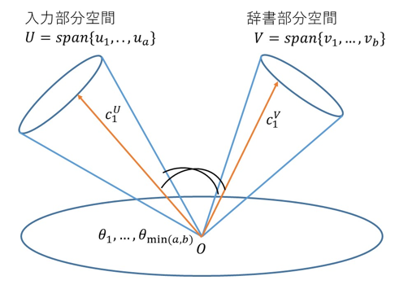
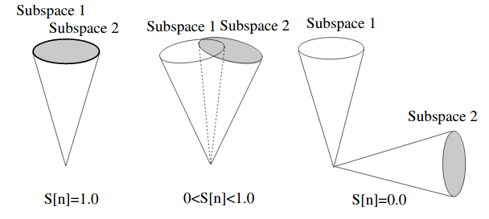

Mutal Subspace Method
=====================

Summary
-------

The Mutual Subspace Method (MSM) is an extension of the Subspace Method (SM), where instead of having an input vector :math:`\mathbf{x}`, we use an input subspace :math:`\mathcal{P}`. MSM is commonly used for image set classification :cite:`sakai2019gait`.

    Fig.1

Theory
------

The Subspace method assumes an input subspace and :math:`k` class subspaces. Let us define the input subspace to be a :math:`d_p`-dimensional subspace :math:`\mathcal{P}` and the class subspaces to be :math:`d_q`-dimensional subspaces :math:`\{\mathcal{Q}, \mathcal{R}, \mathcal{S}...\}`.

The similarity :math:`S` between, for example, :math:`\mathcal{P}` and :math:`\mathcal{Q}` was originally defined as the minimum canonical angle :math:`\theta_1`. Canonical angles :cite:`chatelin2012eigenvalues` are uniquely defined as:

.. math::
    \cos^2 \theta_i = \max_{\substack{u_i \perp u_j(=1,...,i−1) \\ v_i \perp v_j(=1,...,i−1)}} \frac{|(u_1,v_i)|^2}{||u_i||^2||v_i||^2}

Where :math:`\mathbf{u}_i \in \mathcal{P}`, :math:`\mathbf{v}_i \in \mathcal{Q}`, :math:`||\mathbf{u}_i|| \neq 0`, :math:`||\mathbf{v}_i|| \neq 0`.

We can also include the remaining canonical angles when calculating the similarity. 

.. math::
    \tilde{S} = \frac{1}{t} \sum^{t}_{i=1}\cos{\theta_i}^2

This value :math:`\tilde{S}` reflects the structural similarity between two subspaces. It is also defined on the :math:`t` smallest canonical angles.

    Fig.2 `source <https://www.researchgate.net/publication/220757276_Face_Recognition_Using_Multi-viewpoint_Patterns_for_Robot_Vision>`_

For practical applications, the canonical angles can be easily obtained by applying the SVD to the orthonormal basis vectors of the subspaces.

Learning Phase
~~~~~~~~~~~~~~

1. Generate :math:`k` class subspaces from each class by using PCA.

Recognition Phase
~~~~~~~~~~~~~~~~~

1. Calculate :math:`S` (or :math:`\tilde{S}`) between :math:`\mathcal{P}` and each subspace :math:`\mathcal{Q}`. 
2. Classify :math:`\mathcal{P}` into the class where :math:`S` (or :math:`\tilde{S}`) was calculated to be the highest.

Also, you may add a rejection thershold on :math:`S` (or :math:`\tilde{S}`) to reject classifications with low similarity.

.. warning::
    How is the dimension of the input subspaces decided? Are they obtained using PCA?
