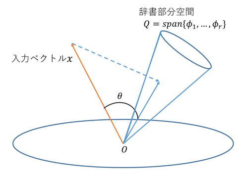

Subspace Method
===============

Theory
------

The Subspace method assumes an input vector :math:`x` and :math:`k`-class subspaces. Each class subspace approximates a data distribution for a single class. This approximation is obtained by applying `PCA <PCA.html>`_ to each class :cite:`Fukui2014`.

.. note::

   Check out the tutorial, "`from pca to the subspace method <../examples/pca_to_sm.html>`_" for a detailed walkthrough for obtaining subspaces using pca.

    Fig.1

The similarity :math:`S` of the input vector :math:`x` to the :math:`i^{th}` class subspace :math:`Q_i` is defined based on either:

* The length of the projection vector :math:`\hat{x}`. That is the projection of :math:`x` to :math:`Q_i` :cite:`watanabe1967evaluation`.
* The minimum angle between :math:`x` and :math:`Q_i` :cite:`iijima1974theory`.

The length of an input vector :math:`x` is often normalized to 1.0. In this case these two criteria are identical. This fact should be obvious from Fig.1.

In the following explanation, therefore, the angle-based similarity S defined by the following equation will be used:

S = cos2θ = ∑dq (p · ϕi)2 i=1 ||p||2, (1) 

where dq is the dimension of the class subspace, and ϕi is the i-th f-dimensional orthogonal normal basis vector of the class subspace, which are obtained from applying the principal component analysis (PCA) to a set of patterns of the class. Concretely, these orthonormal basis vectors can be obtained as the eigenvectors of the correlation matrix
i=1 xix⊤ of the class.

Process flow of the SM The whole process of the SM consists of a learning phase and a recognition phase.
In the learning phase All k class dq-dimensional subspaces are generated from a set of pattern vectors of each class by using PCA.
In the recognition phase The similarities S of an input vector p to all the k class subspaces are calculated by using Equation (1). Then, the input vector is classified into the class of the class subspace with highest similarity. If the highest similarity is lower than a threshold value fixed in advance, the input vector is classified into a reject class

Comments
========

.. disqus::