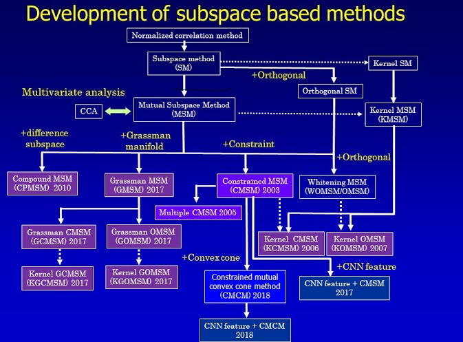

Subspace Methods at a Glance
============================

   
   Subspace methods

Subspace Analysis
----------------------

Subspace analysis in computer vision is a generic name to describe a general framework for comparison and classification of subspaces. A typical approach in subspace analysis is the subspace method (SM) that classify an input pattern vector into several classes based on the minimum distance or angle between the input pattern vector and each class subspace, where a class subspace corresponds to the distribution of pattern vectors of the class in high dimensional vector space. :cite:`Fukui2014`

SM was developed by two Japanese researchers, Watanabe and Iijima around 1970, independently. Watanabe and Iijima named their methods the CLAFIC :cite:`watanabe1967evaluation` and the multiple similarity method :cite:`iijima1974theory`, respectively. 

Furthermore, SM has been extended to mutual subspace method (MSM) by replacing an input vector with an input subspace, where the similarity between the input and reference subspace is measured by the canonical angles between them. This allows for high performance in tasks such as image set classification :cite:`fukui2005face`. 

MSM is well known as one of the most natural and effective classification method for image-sets in pattern recognition and computer vision. 

There are many other powerful extensions of SM, the following have been implemented:

- Subspace Method
- Mutual Subspace Method
- Constrained Subspace Method
- Kernel MSM/ Kernel CMSM

See the following `short survey <http://www.cvlab.cs.tsukuba.ac.jp/~kfukui/english/epapers/subspace_method.pdf>`_ on subspace methods for a starting point to learn more.

References
..........
.. bibliography:: ../ref.bib